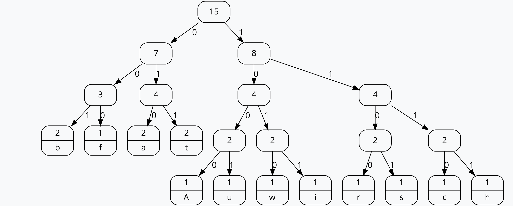

# DATEN KOMPRIMIEREN AUFGABEN
## Aufgabe 1
Q: Huffman-Algorithmus: Wir beschäftigen uns hier mit sogenannten Baumstrukturen.
Kennen sie noch andere Gebiete in der IT, wo Baumstrukturen zur Anwendung
kommen? Beim Huffman handelt es sich sogar um eine spezielle Baumstruktur,
nämlich einem sogenannten binären Baum. Was unterscheidet einen binären Baum von einem nicht binären Baum?

A: Ein Binärbaum ist eine Datenstruktur, bei der jeder Knoten maximal zwei Kinderknoten hat, die als linker und rechter Teilbaum bezeichnet werden. Ein Knoten kann null, einen oder zwei Kinder haben. Ein nicht-binärer Baum hingegen kann Knoten mit mehr als zwei Kindern haben.

## Aufgabe 2
Abbauwirtschaft
100 101 101 00000 11 01 11 00011 00100 11 00101 00110 00001 11
| Zeichen | Huffman-Code |
|---|---|
| A | 100 |
| B | 101 |
| C | 00000 |
| F | 00001 |
| H | 00010 |
| I | 00011 |
| R | 00100 |
| S | 00101 |
| T | 00110 |
| U | 11 |
| W | 01 |
 
 

## Aufgabe 3

Mit 5 Bit kann man eine Linie von Pixeln im Bild darstellen. Es könnte 1 Bit oder kein Bit sein, da man einfach die Farbe angeben kann.

Beispiele:

- 10100Gelb 1011Gelb, 10Schwarz, 111Gelb
- 10100Blau 1011Blau, 1Rot, 1Schwarz, 111Blau 100Blau, 10Rot, 1Schwarz, 10Blau, 101Rot, 1Schwarz, 5Blau
- 1Blau

## Aufgabe 4

Sie erhalten diesen RL-Code: 010100011110010010010010010010010010010110010110010010010010010010010010001 

```
010 100 011 110 010 010 010 010 010 010 010 010 010 110 010 110 010 010 010 010 010 010 010 010 001
 |   |   |   |   |   |   |   |   |   |   |   |   |   |   |   |   |   |   |   |   |   |   |   |   |
 2   4   3   6   2   2   2   2   2   2   2   2   2   6   2   6   2   2   2   2   2   2   2   2   1
 |   |   |   |   |   |   |   |   |   |   |   |   |   |   |   |   |   |   |   |   |   |   |   |   |
 W   S   W   S   W   S   W   S   W   S   W   S   W   S   W   S   W   S   W   S   W   S   W   S   W

WWSSSSWW
WSSSSSSW
WSSWWSSW
WSSWWSSW
WSSSSSSW
WSSSSSSW
WSSWWSSW
WSSWWSSW


  XXXX
 XXXXXX
 XX  XX
 XX  XX
 XXXXXX
 XXXXXX
 XX  XX
 XX  XX
```

Es wird ein 'A' dargestellt.

## Aufgabe 5

### a. 

| Zeichenkette | Gefunden | Gespeichert | Eintrag | Nummer |
| ------------ | -------- | ----------- | ------- | ------ |
| ananas       | a        | a           | an      | 256    |
| nanas        | n        | n           | na      | 257    |
| anas         | a        | 256         | ana     | 258    |
| as           | a        | a           | as      | -      |

ANANAS = an256as

### b. 

| Zeichenkette  | Gefunden | Ausgabe | Eintrag | Nummer |
| ------------- | -------- | ------- | ------- | ------ |
| erdbe256kl260 | e        | e       | er      | 256    |
| rdbe256kl260  | r        | r       | rd      | 257    |
| dbe256kl260   | d        | d       | db      | 258    |
| be256kl260    | b        | b       | be      | 259    |
| e256kl260     | e        | e       | ee      | 260    |
| 256kl260      | er       | 256     | er      | -      |
| kl260         | k        | k       | ek      | 261    |
| l260          | l        | l       | kl      | 262    |
| 260           | ee       | 260     | ee      | -      |

erdbe256kl260 = erdbeerdklee

## Aufgabe 6

### a.
 Die BWT-Transformation für das Wort "ANANAS" lautet "SNNAAA1".

### b. 
Die Rücktransformation des Codes "IICRTGH6" in der Burrows-Wheeler-Transformation ergibt das Wort "RICHTIG".

## Aufgabe 7
### a. 
Ich werde fünf ASCII-Textdateien erstellen, die jeweils 10, 100, 1000, 10.000 und 100.000 zufällig ausgewählte ASCII-Zeichen enthalten.

### b. 
Ich werde darauf achten, dass die Zeichen möglichst zufällig ausgewählt werden, um eine realistische Untersuchung der ZIP-Komprimierung durchzuführen.

### c. 
Nachdem ich die Textdateien erstellt habe, werde ich jede von ihnen in eine eigene ZIP-Datei kopieren.

### d. 
In einer Excel-Tabelle werde ich die erforderlichen Speichergrößen für jede ASCII-Datei im Vergleich zur ZIP-Datei auswerten. Ich werde versuchen, die Ergebnisse zu interpretieren und zu begründen, indem ich mögliche Muster oder Trends identifiziere.

### e. 
Ich werde eine weitere ASCII-Textdatei erstellen, die 100.000 Zeichen enthält, aber ausschließlich den Buchstaben "A". Anschließend werde ich diese Datei zippen und die Speichergröße mit der ZIP-Datei vergleichen, die aus einer zufälligen Abfolge von 100.000 Zeichen besteht. Ich werde den Unterschied in den Speichergrößen erklären, indem ich auf die ZIP-Komprimierung von wiederholten Zeichen im Vergleich zu zufälligen Zeichen eingehe.

### f. 
Ich werde zwei Bilddateien erhalten, eine mit hoher und eine mit niedriger Auflösung. Nachdem ich diese erhalten habe, werde ich sie zippen und die resultierenden Speichergrößen vergleichen. Ich werde mein Ergebnis begründen, indem ich auf die bereits vorhandene Komprimierung im JPEG-Format hinweise und wie ZIP-Komprimierung auf bereits komprimierte Dateien wirkt.

## Aufgabe 8

### Alternativen zu RLC:

- Lempel-Ziv-Welch (LZW)
- Deflate
- Arithmetic Coding

### Daten, die verlustlos komprimiert werden sollten:

- Textdateien
- Datenbanken
- Quellcode (z.B. Java)

### Auswirkungen verlustbehafteter Komprimierung auf Texte und Quellcode:

- Verlust von Wörtern
- Verlust von Daten
- Unlesbarkeit
- Unausführbarkeit von Code
- Syntaxfehler