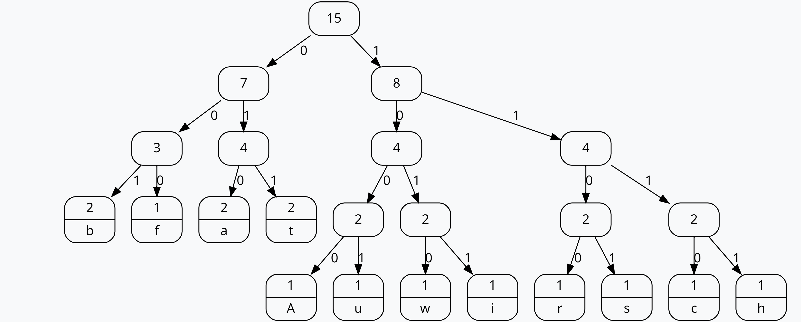

# DATEN KOMPRIMIEREN AUFGABEN
## Aufgabe 1
Q: Huffman-Algorithmus: Wir beschäftigen uns hier mit sogenannten Baumstrukturen.
Kennen sie noch andere Gebiete in der IT, wo Baumstrukturen zur Anwendung
kommen? Beim Huffman handelt es sich sogar um eine spezielle Baumstruktur,
nämlich einem sogenannten binären Baum. Was unterscheidet einen binären Baum von einem nicht binären Baum?

A: Ein Binärbaum ist eine Datenstruktur, bei der jeder Knoten maximal zwei Kinderknoten hat, die als linker und rechter Teilbaum bezeichnet werden. Ein Knoten kann null, einen oder zwei Kinder haben. Ein nicht-binärer Baum hingegen kann Knoten mit mehr als zwei Kindern haben.

## Aufgabe 2
Abbauwirtschaft
100 101 101 00000 11 01 11 00011 00100 11 00101 00110 00001 11
| Zeichen | Huffman-Code |
|---|---|
| A | 100 |
| B | 101 |
| C | 00000 |
| F | 00001 |
| H | 00010 |
| I | 00011 |
| R | 00100 |
| S | 00101 |
| T | 00110 |
| U | 11 |
| W | 01 |
 
 